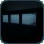

# Liminal Library

Liminal Library, or LimLib, is the common library used by Dimensional Development mods, including The Corners, Dimensional Doors, and future projects. It adds no gameplay on its own.

LudoCrypt originally created LimLib as an embedded library for The Corners. This standalone version combines the original library with common code from both The Corners and Dimensional Doors, including the replacement for Special Models, which adds custom rendering to normal block models. It also makes the library available for both Fabric and NeoForge.

For mod developers, LimLib provides:

* Cross-platform abstractions for Fabric and NeoForge.
* APIs for custom dimensions and chunk generators.
* Utilities for loading and placing NBT structures, including rotation and mirroring.
* Structure piece pools that datapacks can extend or replace.
* Maze generation utilities.
* Custom dimension rendering, skyboxes, and post-processing effects.
* Reverb and distortion effects.
* Support for custom shader effects on normal block models without requiring a block entity renderer.
